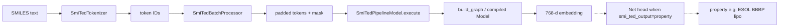

# Learning path: SMI-TED MAX port

A hands-on guide to understanding this repo. Work the phases in order; each one unlocks the next.

| | |
|---|---|
| **What this is** | A [MAX](https://docs.modular.com/max/) custom architecture for [ibm-research/materials.smi-ted](https://huggingface.co/ibm-research/materials.smi-ted) |
| **What it does** | SMILES → **768-d embedding**, or finetuned SMILES → **property** via in-graph `Net` |
| **Time** | ~3–5 hours reading + 30–60 min running |
| **Status** | See [`PORT.md`](../PORT.md) — graph builds; embedding parity still open |

## How to use this guide

1. Do **one phase at a time**. Stop at each checkpoint and answer it out loud or in notes.
2. Prefer reading code over skimming — the interesting parts are small.
3. When stuck, ask: *is this wiring (MAX plumbing) or math (the network)?*
4. Optional: keep the book’s [`gpt2_arch`](https://github.com/modular/max-llm-book/tree/main/gpt2_arch) open as a simpler sibling of the same pattern.

### Progress

- [ ] Phase 0 — Orient
- [ ] Phase 1 — How MAX finds the model
- [ ] Phase 2 — Request path
- [ ] Phase 3 — Network (`graph.py`)
- [ ] Phase 4 — Weights
- [ ] Phase 5 — Run and verify
- [ ] Phase 6 — Property prediction (frozen-head demo)
- [ ] Phase 7 — Finetune → MAX property serve (ESOL / BBBP / lipo)

---

## Mental model (read this first)

Two layers of the same system:

```text
┌─────────────────────────────────────────────────────────────┐
│  MAX serve plumbing                                         │
│  arch → tokenizer → batch → pipeline model → weights        │
└────────────────────────────┬────────────────────────────────┘
                             │ calls
                             ▼
┌─────────────────────────────────────────────────────────────┐
│  Network math (graph.py)                                    │
│  tokens → MoLEncoder → AutoEncoder → 768-d embedding        │
└─────────────────────────────────────────────────────────────┘
```

End-to-end data flow:



**Folder map**

| Path | Role |
|------|------|
| [`materials_smi_ted/`](../materials_smi_ted/) | Custom MAX architecture package |
| [`model_assets/ibm-research_materials.smi-ted/`](../model_assets/ibm-research_materials.smi-ted/) | Local model dir (`config.json` + weights/vocab) |
| [`scripts/`](../scripts/) | Setup, tests, HF compare, property head |
| [`checkpoints/`](../checkpoints/) | Frozen-head demo checkpoints (Phase 6) |
| [`finetune_ckpts/`](../finetune_ckpts/) | IBM full-finetune `.pt` inputs (Phase 7) |
| [`model_assets/smi-ted-*`](../model_assets/) | Exported property-serve assets |
| [`PORT.md`](../PORT.md) | Port status and HF↔MAX deltas |
| [`pixi.toml`](../pixi.toml) | Env + runnable tasks |

---

## Phase 0 — Orient (15–20 min)

**Goal:** Know what this repo is *for* before opening implementation files.

1. Read [`PORT.md`](../PORT.md) — status table, architecture summary, known gaps.
2. Skim the `[tasks]` section of [`pixi.toml`](../pixi.toml).
3. Glance at the folder map above; do not dive into `graph.py` yet.

**Look for**

- Donor was `bert` (embeddings task), heavily rewritten.
- Encode path — LM / AE-decoder heads dropped; `net.*` kept (used when `smi_ted_output=property`).
- Linear-attention normalizer (`Z`) is implemented; confirm embedding parity with `compare-hf`.

**Checkpoint:** In one sentence: *This repo ports SMI-TED into MAX so you can serve SMILES embeddings.*

---

## Phase 1 — How MAX finds the model (30–40 min)

**Goal:** Trace `pixi run serve` from CLI flags to the Python package.

Read in order:

1. [`materials_smi_ted/__init__.py`](../materials_smi_ted/__init__.py) — exports `ARCHITECTURES = [smi_ted_arch]`
2. [`materials_smi_ted/arch.py`](../materials_smi_ted/arch.py) — `SupportedArchitecture(...)` wires everything together
3. [`model_assets/.../config.json`](../model_assets/ibm-research_materials.smi-ted/config.json) — `"architectures": ["SmiTedModel"]` must match `arch.name`
4. [`scripts/setup_model_assets.py`](../scripts/setup_model_assets.py) — downloads Hub weights/vocab into `model_assets/`

**What `arch.py` plugs in**

| Field | Points to |
|-------|-----------|
| `name` | `"SmiTedModel"` (must match config) |
| `task` | `EMBEDDINGS_GENERATION` |
| `pipeline_model` | `SmiTedPipelineModel` |
| `tokenizer` | `SmiTedTokenizer` |
| `batching` | `SmiTedBatchProcessor` |
| `config` | `SmiTedModelConfig` |
| `weight_adapters` | safetensors → MAX state dict |

Serve command (from pixi) is essentially:

```bash
max serve \
  --model-path ./model_assets/ibm-research_materials.smi-ted \
  --custom-architectures ./materials_smi_ted \
  --quantization-encoding float32
```

**Checkpoint:** Explain how `--custom-architectures` + `config.json` `"architectures"` select this package.

---

## Phase 2 — Request path (45–60 min)

**Goal:** Trace one SMILES string from HTTP/API input to `model.execute`, *without* understanding attention math yet.

Read in order:

1. [`tokenizer.py`](../materials_smi_ted/tokenizer.py) — SMILES regex + `bert_vocab_curated.txt` → token IDs
2. [`batch_processor.py`](../materials_smi_ted/batch_processor.py) — pads every sequence to `max_len` (202); builds `SmiTedInputs`
3. [`model_config.py`](../materials_smi_ted/model_config.py) — hyperparams from HuggingFace-style config (`n_layer`, `n_embd`, …)
4. [`model.py`](../materials_smi_ted/model.py) — `load_model` builds/compiles the graph; `execute` runs it

**Key types**

| Type | Meaning |
|------|---------|
| `SmiTedInputs` | `next_tokens_batch` + `attention_mask` buffers |
| `SmiTedPipelineModel` | MAX pipeline wrapper (not the neural net itself) |
| `build_graph(...)` | Called from `load_model`; returns the MAX `Graph` |

**Look for in `model.py`**

- Adapter runs first (if present), then `build_graph(config, state_dict)`, then `session.load(...)`.
- `execute` just forwards the two buffers and lets the batch processor shape outputs.

**Checkpoint:** Draw (or narrate): `SMILES → tokenize → pad/mask → execute → embedding`.

---

## Phase 3 — The network (`graph.py`) (60–90 min)

**Goal:** Understand the encode path. This is the counterpart of the book’s [`gpt2.py`](https://github.com/modular/max-llm-book/blob/main/gpt2_arch/gpt2.py).

File: [`materials_smi_ted/graph.py`](../materials_smi_ted/graph.py)

### Suggested read order inside the file

| Step | Symbol | What it does |
|------|--------|--------------|
| 1 | Module docstring | Encode path in one paragraph |
| 2 | Helpers | `_reshape_heads`, `_rotate_half`, `_apply_rotary_pos_emb` |
| 3 | `FeatureMap` | ReLU random features (Performer-style) |
| 4 | `InnerLinearAttention` | Linear attention (not softmax QKᵀ) |
| 5 | `RotateAttentionLayer` | QKV + RoPE + linear attn + out proj |
| 6 | `TransformerEncoderLayer` | Residual / norm / FFN wiring |
| 7 | `MoLEncoder` | Token embed + stacked encoder blocks |
| 8 | `AutoEncoder` / `MoLDecoder` | Maps token states → 768-d vector |
| 9 | `SmiTedModel` | Full encode module |
| 10 | `build_graph` | Wraps the module in a MAX `Graph` |

### Encode sketch

```text
input_ids, attention_mask
        │
        ▼
   MoLEncoder
   (token embed → 12 × RotateAttention + FFN)
        │
        ▼
   flatten / pad to fixed layout
        │
        ▼
   decoder.autoencoder.encoder
        │
        ▼
   768-d SMILES embedding
```

### Deltas vs a normal BERT donor ([`PORT.md`](../PORT.md))

| Piece | Here |
|-------|------|
| Attention | Performer linear attention + RoPE |
| Block order | Post-attn residual, pre-FFN norm (`fast_transformers` style) |
| Embeddings | Token only (no position/type embeddings) |
| Head | Decoder autoencoder encoder (not a BERT pooler); optional `Net` |
| Not in graph | LM heads, AE decoder (reconstruction) |

`InnerLinearAttention` includes the linear-attention denominator (`Z` from `fast_transformers`): divide \(\phi(Q)(\phi(K)^\top V)\) by \(\phi(Q)(\phi(K)^\top\mathbf{1})+\varepsilon\).

**Checkpoint:** Sketch tokens → 12 layers → AE encoder → 768-d, and name one difference from BERT.

---

## Phase 4 — Weights (20–30 min)

**Goal:** See which Hub tensors feed the graph and which are discarded.

1. Read [`weight_adapters.py`](../materials_smi_ted/weight_adapters.py).
2. Match a few kept prefixes to classes in `graph.py`.
3. Cross-check ignored prefixes with [`PORT.md`](../PORT.md).

**Kept (used by encode graph)**

- `encoder.*`
- `decoder.autoencoder.encoder.*`

**Ignored (training / other heads)**

- `encoder.lang_model.*`
- `decoder.lang_model.*`
- `decoder.autoencoder.decoder.*`

**Also kept**

- `net.*` (used when `smi_ted_output=property`)

**Checkpoint:** Name two weight prefixes that are dropped and why.

---

## Phase 5 — Run and verify (30–60 min)

**Goal:** Prove the plumbing works; see where parity still fails.

From the repo root (`max_ports/`):

```bash
# 1. Download / link weights + vocab
pixi run setup-model

# 2. Fast local checks (no server)
pixi run test

# 3. Serve (CPU or GPU) in one terminal
pixi run serve
# or: pixi run serve-gpu

# 4. Hit the running server
pixi run test-serve

# 5. Compare to Hugging Face reference
pixi run compare-hf
```

**Also useful**

| Task | Purpose |
|------|---------|
| `pixi run test-all` | Local + serve + optional HF compare |
| `pixi run gates` | OSS import-model gates (if available in this env) |

**Checkpoint:** You have produced an embedding and can compare it to the HF reference.

---

## Phase 6 — Property prediction (frozen-head demo, 45–60 min)

**Goal:** See embeddings used as a frozen feature extractor (weaker than IBM full finetune).

Only after Phases 0–5 make sense.

1. Read [`scripts/predict_property.py`](../scripts/predict_property.py) — `train` / `evaluate` / `predict`.
2. Inspect [`checkpoints/esol/`](../checkpoints/esol/) — saved `Net` head.
3. Notice backends: PyTorch embeddings for training/eval convenience; MAX for serve-backed predict.

```bash
pixi run train-property
pixi run evaluate-property
# with serve running:
pixi run predict-property -- --smiles "CCO"
```

**Checkpoint:** This path trains a head on **frozen** pretrained embeddings only.

---

## Phase 7 — Finetune → MAX property serve (ESOL / BBBP / lipo)

**Goal:** Serve IBM full-finetune weights (encoder + AE encoder + `Net`) from MAX.

1. On a GPU host, run IBM finetune scripts under `vendor/.../finetune/smi_ted_light/{esol,bbbp,lipo}/`.
2. Export with [`scripts/export_finetune_to_max.py`](../scripts/export_finetune_to_max.py) → `model_assets/smi-ted-{task}/`.
3. Confirm [`graph.py`](../materials_smi_ted/graph.py) `Net` + `smi_ted_output=property` in asset `config.json`.
4. Serve and call `/v1/embeddings` (length-1 vector = prediction).

```bash
pixi run export-finetune -- --checkpoint finetune_ckpts/esol/CKPT.pt --task esol
pixi run serve-esol
pixi run predict-finetuned -- --task esol --smiles CCO
pixi run compare-finetune -- --task esol --smiles CCO
```

Details: [`PORT.md`](../PORT.md).

**Checkpoint:** Property mode keeps `PipelineTask.EMBEDDINGS_GENERATION` but returns a 1-d "embedding" = the property value (BBBP logit).

---

## Suggested reading order (files only)

```text
PORT.md
pixi.toml
materials_smi_ted/__init__.py
materials_smi_ted/arch.py
model_assets/ibm-research_materials.smi-ted/config.json
scripts/setup_model_assets.py
materials_smi_ted/tokenizer.py
materials_smi_ted/batch_processor.py
materials_smi_ted/model_config.py
materials_smi_ted/model.py
materials_smi_ted/graph.py              ← deepest
materials_smi_ted/weight_adapters.py
scripts/test_smi_ted.py
scripts/compare_hf_embeddings.py
scripts/predict_property.py             ← frozen-head demo
scripts/export_finetune_to_max.py       ← finetune → MAX assets
scripts/predict_finetuned.py
scripts/compare_finetune_property.py
```

---

## Map to the MAX LLM Book

Same custom-arch pattern as [gpt2_arch](https://github.com/modular/max-llm-book/tree/main/gpt2_arch):

| Book | Role | This repo |
|------|------|-----------|
| `gpt2.py` | Network math | `graph.py` |
| `model.py` | Pipeline wrapper | `model.py` |
| `arch.py` | Registration | `arch.py` |
| *(inline / HF)* | Tokenizer | `tokenizer.py` |
| *(simpler)* | Batching | `batch_processor.py` |
| `weight_adapters.py` | Weight rename/filter | `weight_adapters.py` |

Differences that matter while learning:

- **API:** book uses `max.experimental.nn`; this port uses `max.graph` / `max.nn` + explicit `build_graph`.
- **Task:** GPT-2 → logits (causal LM); SMI-TED → fixed embedding vector.
- **Attention:** GPT-2 softmax causal attn; SMI-TED linear attention + RoPE.

---

## Glossary

| Term | Meaning here |
|------|----------------|
| **SMILES** | Text encoding of a molecule (e.g. `CCO` = ethanol) |
| **Custom architecture** | Python package MAX loads via `--custom-architectures` |
| **Donor** | Starting MAX arch pattern (`bert` embeddings) that was rewritten |
| **Encode path** | Inference path that produces the 768-d vector |
| **Linear attention** | Performer-style attention via feature maps (not full QKᵀ softmax) |
| **RoPE** | Rotary position embeddings applied to Q/K |
| **Property head / `net`** | Small MLP for downstream tasks; in-graph when `smi_ted_output=property` |
| **Finetune asset** | `model_assets/smi-ted-{esol,bbbp,lipo}/` from `export-finetune` |
| **Parity** | Numerical agreement with the Hugging Face / PyTorch reference |

---

## If you only have one hour

1. Phase 0 (`PORT.md` + folder map) — 10 min  
2. Phase 1 (`arch.py` + `config.json`) — 15 min  
3. Phase 2 (`model.py` + `batch_processor.py`) — 15 min  
4. Phase 3 skim: docstring + `SmiTedModel` + `build_graph` only — 20 min  

Come back later for attention internals, weights, and running serve.
